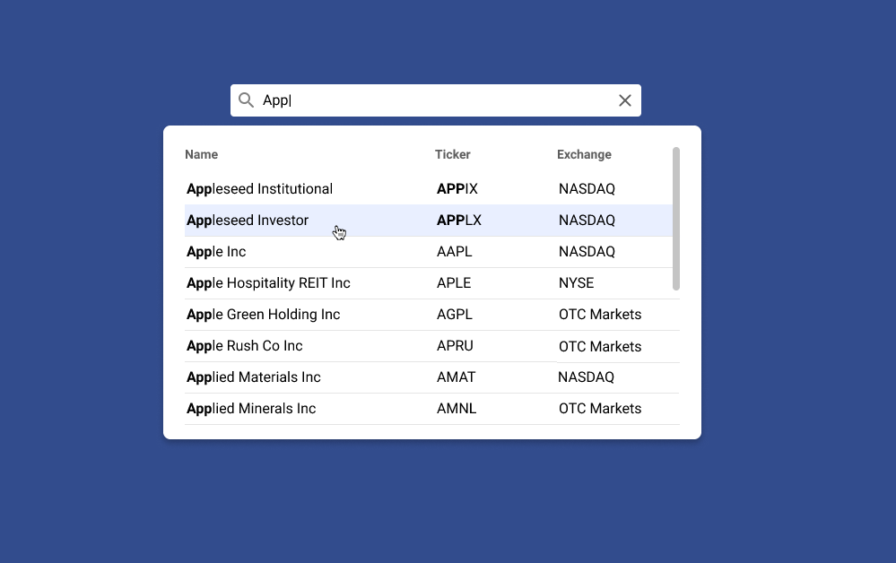

# Morningstar Interview

## Requirements
Refer to the following Figma and create a Front End component.  Use your Front End and framework of choosing (Vue, React, Angular, etc).
https://www.figma.com/proto/z313J0dzU6u9TTFNMB8tyB/Search-with-Auto-Complete-Design-Spec?page-id=0%3A1&node-id=8%3A485&viewport=253%2C48%2C0.27&scaling=min-zoom
  - Page 1 of the Figma is guidance on assets/colors to use
  - Page 2 of Figma is expected functionality
  - Page 3 is what the component should look like (note the blue background is not part of the component)

The Back End API to use by the front end:
  - Can be found here https://github.com/kmcdon83/mock-fund-api-js
  - Clone and run it locally
  - Details for running the API can be found in the repo README

### Font
Roboto font

### Material Icons by Google
  - [Search](https://fonts.google.com/icons?icon.query=search)
  - [Close](https://fonts.google.com/icons?icon.query=close)

### Colors
  - Primary Text Color `#000000`
  - Secondary Text Color `#5E5E5E`
  - Icon Color `#5E5E5E`
  - Hover Color `#E9EFFF`

### Search input
- Placeholder text
  - Search for securities
- On input, "clear" (Close icon) should appear
  - Hover/focus state:
    - Icon background `#E9Efff`
    - Cursor change to `pointer`

### Search Results
- Three columns with headers:
  - Name
  - Ticker
  - Exchange
- Hover/focus state:
  - Background color `#E9EFF`
- UX Notes:
  - Search results should close and clear when "clear" button in search field is clicked
  - If underlying page is clicked or escape key is pressed the search results should be hidden
    - User input and search results are retained
    - If the user clicks back into the search field the results should open with the same content (no API request)

### Page Background Color
`#324c8d`

### Reference image

## Developer Notes
### Module
Module will:
  - Set intial state
  - Render initial state
  - Handle user input
  - Render updated state
  - Perform self-cleanup

This can be done with vanilla JS. There are many frameworks (like React) that provide a method to do this for you but I wanted to showcase that I understand and can implement the underlying behavior and create our own custom modules when needed. The design principles used to create this module can be followed and reproduced in other frameworks.

### Debouncing
While not in the requirements I expect user input to be debounced so every keystroke does not trigger an HTTP request to the API. JS `setTimeout` and a `.value` check will suffice.

### Git Branching
Branch name assumes project name similar to `Morningstar Interview`, with my task being the first (1) created; resulting in `mi-1`.

### Security
Even though in this exercise we control the API, we should still clean response data that are output to the page.

## Running
This exercise is a simple `index.html` file that you can click to open as a local file or serve via HTTPS any way you want. I prefer using `npx http-server -S -C cert.pem -o`, but you will need to generate your own `cert.pem` and `key.pem`. See [StackOverflow](https://stackoverflow.com/questions/12871565/how-to-create-pem-files-for-https-web-server) for examples.

## Testing
Selenium, Mocha, and Chai are used to test this module. Run `mocha ./lib/Search/test.js` while in the project directory for the test specific to this module.
chromedriver.exe (or just chromedriver for mac/linux) that matches your Chrome build version should be either in your path or project directory. chromedriver included in project is ChromeDriver version 123.0.6312.122. For the latest version see [Chrome for Testing availability](https://googlechromelabs.github.io/chrome-for-testing/). For older versions see [Older Releases](https://chromedriver.chromium.org/downloads).

## Future/WIP
With more time we can:
  - Specify NPM commands/scripts and other CLI tools to run tests automatically, parse SCSS, and lint code
  - Implement pagination
  - Provide further filtering or sorting of data